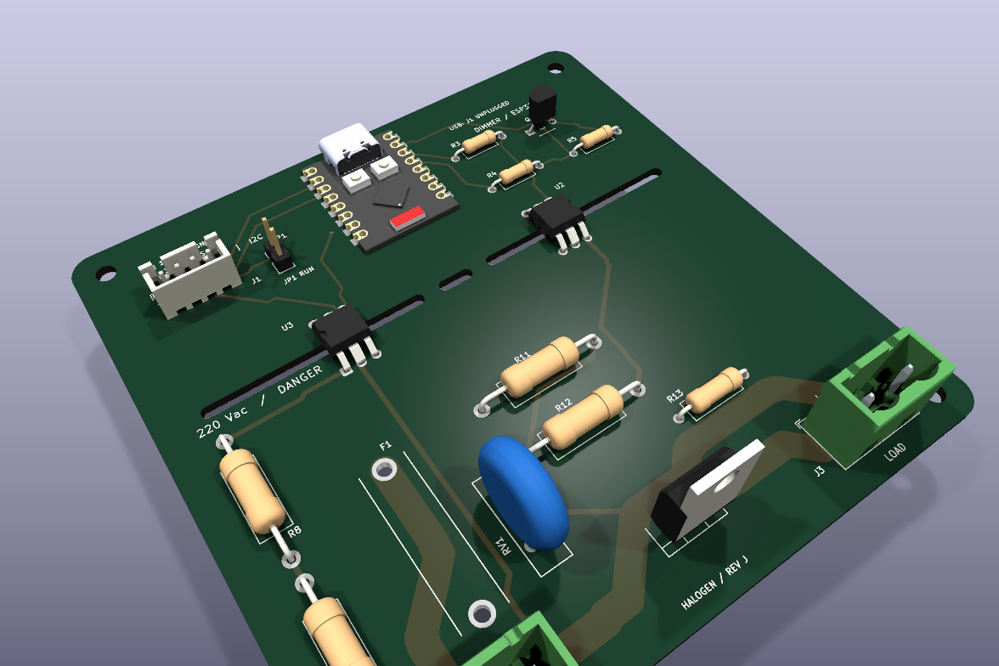
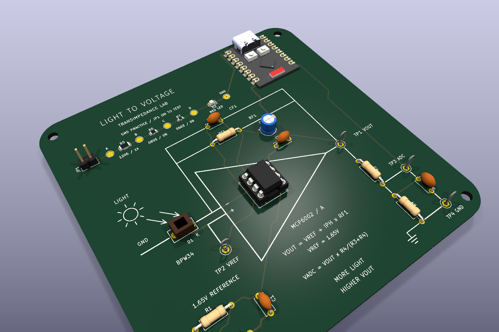

<div align="center">

# [pcbs_llm_driven_design](https://github.com/fborello-lambda/pcbs_llm_driven_design)

Four KiCad 10 hardware projects developed through an LLM-assisted design workflow.

Schematics · routed PCBs · readable BOMs · 3D previews · reproducible fabrication exports

</div>

| Board | Preview | Design files |
| --- | --- | --- |
| [220 Vac halogen dimmer](dimmer/) | [](dimmer/docs/board-3d.png) | [KiCad project](dimmer/esp32_dimmer.kicad_pro) · [schematic PDF](dimmer/docs/schematic.pdf) · [BOM](dimmer/docs/BOM.csv) |
| [BLE remote controller](remote_controller/) | [](remote_controller/docs/board-3d.png) | [KiCad project](remote_controller/esp32c3_remote.kicad_pro) · [schematic PDF](remote_controller/docs/schematic.pdf) · [BOM](remote_controller/BOM.csv) |
| [Photodiode TIA laboratory](photodiode_lab/) | [](photodiode_lab/docs/board-3d.png) | [KiCad project](photodiode_lab/photodiode_lab.kicad_pro) · [schematic PDF](photodiode_lab/docs/schematic.pdf) · [BOM](photodiode_lab/BOM.csv) |
| [Raspberry Pi SPI0 breakout](raspberry_spi0_breakout/) | [](raspberry_spi0_breakout/docs/board-3d.png) | [KiCad project](raspberry_spi0_breakout/raspberry_spi0_breakout.kicad_pro) · [schematic PDF](raspberry_spi0_breakout/docs/schematic.pdf) · [BOM](raspberry_spi0_breakout/BOM.csv) |

## Fabricated board photos

> **Coming soon:** photographs of the assembled boards will be added here after fabrication and bring-up.

| Halogen dimmer | BLE remote controller | Photodiode TIA lab | Raspberry Pi SPI0 breakout |
| --- | --- | --- | --- |
| Photo pending | Photo pending | Photo pending | Photo pending |

## Repository layout

Each board has one self-contained project directory. Reusable ESP32-C3 symbol, footprint, and STEP assets live in `shared/`; deterministic generators and validation tools live in `scripts/`. Personal KiCad state, editor settings, caches, credentials, reports, and temporary files are excluded from version control.

The three ESP32 boards consume the same canonical ESP32-C3 SuperMini library. The Raspberry Pi board is an independent passive SPI0 adapter.

## Validation

Create the Python environment with access to KiCad's system-provided `pcbnew` module, then run the repository checks:

```sh
uv venv --python /usr/bin/python3 --system-site-packages
uv sync
uv run --no-sync python scripts/check_all.py
```

The check runs ERC, DRC, and schematic/PCB parity for all four projects. It also verifies the shared ESP32 footprint geometry and STEP reference on the three ESP32 boards.

Regenerate the committed documentation assets with:

```sh
uv run --no-sync python scripts/export_publishable_docs.py
```

## Fabrication ZIPs

Generate deterministic Gerber/drill ZIPs for all four boards with:

```sh
uv run --no-sync python scripts/export_fabrication.py
```

The ZIPs are written under each project's ignored `outputs/` directory. Publish tested ZIPs as GitHub Release assets so generated manufacturing files do not obscure source review or become stale in the main branch.

## Safety

These boards are engineering prototypes, not certified products. In particular, the dimmer switches 220 Vac and requires qualified review of creepage, clearance, insulation, fuse coordination, connector ratings, thermal performance, enclosure, EMC, and fabrication constraints before use. CAD checks do not establish electrical safety or the advertised load rating.
