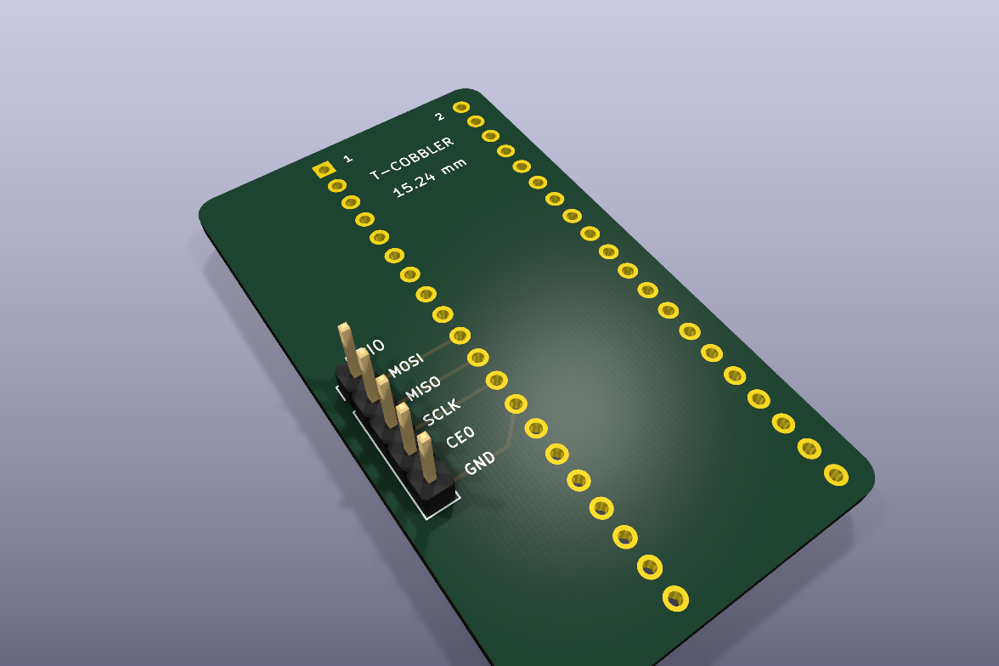

# Raspberry Pi GPIO extender — SPI0 breakout

[KiCad project](raspberry_spi0_breakout.kicad_pro) · [Schematic PDF](docs/schematic.pdf) · [BOM CSV](BOM.csv)

30 x 53 mm receiving carrier with R2 mm rounded corners for the breadboard pins of a T-Cobbler extender.
J1 takes two 1x20 female strips, 15.24 mm apart, with 2.54 mm pitch and
48.26 mm between first and last pins. Odd pins are left, even pins right,
viewed from above with the extender cable end at the top. The cable end
overhangs this carrier; the SPI connector remains accessible at its left side.

Mechanical source: [official Adafruit CAD](https://github.com/adafruit/Adafruit-Pi-Cobber-PCBs/blob/master/Adafruit%20T-Cobbler%20Plus.brd).
JP1 and JP2 have X coordinates 36.83 and 21.59 mm in that board. The local
receiving footprint is independently generated with 1 mm drills and 1.7 mm pads.
The red clone's manufacturer is not confirmed: check its row spacing is
15.24 mm before fabrication. Overall 58 x 73 mm dimensions alone do not
establish the pin geometry.

J2 is a single 1x5, 2.54 mm-pitch output row, top to bottom as marked on the
front silkscreen:

| J2 pin | Signal | Raspberry Pi physical GPIO-header pin |
| --- | --- | --- |
| 1 | MOSI (GPIO10) | 19 |
| 2 | MISO (GPIO9) | 21 |
| 3 | SCLK (GPIO11) | 23 |
| 4 | CE0 (GPIO8) | 24 |
| 5 | GND | 25 |

The square pad identifies physical pin 1. Tracks are 0.30 mm wide, CE0 uses
back copper, and no vias are required. Unused J1 pins are isolated.
Regenerate using `uv run --no-sync python scripts/raspberry_spi0_breakout/build_board.py`.
The repository check runs ERC, DRC, and schematic/PCB parity for this carrier.
