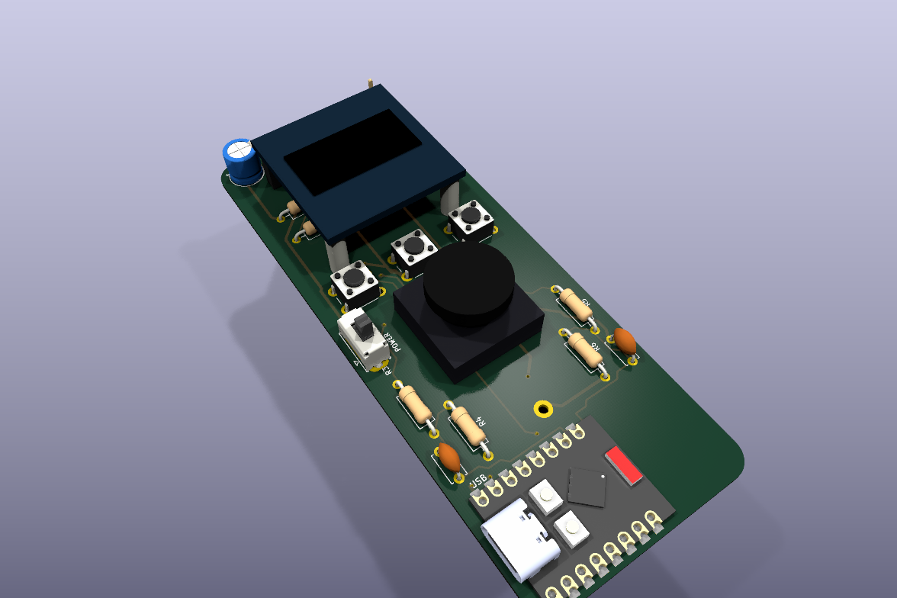
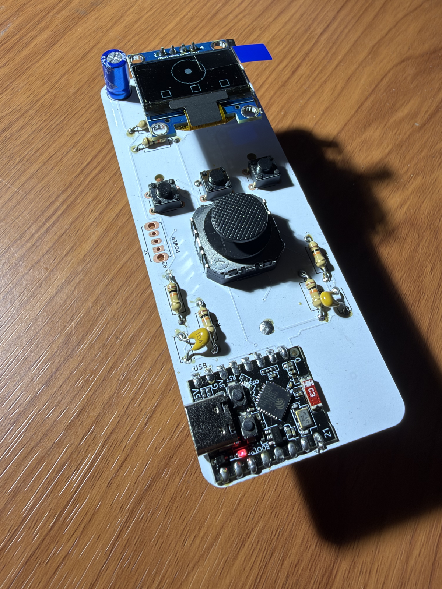

# ESP32-C3 BLE dimmer remote — revision G

<a href="docs/board-3d.png"></a> <a href="docs/photo.png"></a>

[KiCad project](esp32c3_remote.kicad_pro) · [Schematic PDF](docs/schematic.pdf) · [BOM CSV](BOM.csv)

Revision G is a 40 x 100 mm, 0.8 mm, two-layer controller for the dimmer. The ESP32-C3 SuperMini is directly soldered to the shared `Shared:ESP32-C3-SuperMini` SMD landing-pad footprint; there are no socket strips. A direct-solder Adafruit 2765 Mini Thumbstick controls brightness, three tactile buttons provide ON/SELECT, OFF/BACK, and PRESET, and a small I2C OLED reports state. There is no LDR in this revision.

The generated placement is portrait. The rear MPD BK-18650-PC2 holder is centred at x=20 mm, with its positive terminal at y=2.5 mm and its negative terminal at y=75.4 mm; the holder body ends at y=77.23 mm. The front OLED header starts at (16.19, 9.5) mm and reads VCC, GND, SCL, SDA from the front. The OLED support holes are at (8.35, 33.8) and (31.65, 33.8) mm. Button centres are x=8, 20, 32 mm at y=40 mm. The joystick centre is (20, 55.5) mm. The ESP32 footprint is at (13.5, 90) mm, rotated 90 degrees. Its USB faces outward through the left edge, with the connector mouth 0.5 mm inside the edge. The complete module is inside the 40 x 100 mm board. The four corner mounting holes were removed and the corner radius is 4 mm. Only the two OLED support holes remain.

The holder footprint uses an intentionally elevated terminal courtyard. Install a rigid insulating spacer with adhesive, with a total assembled thickness of 1.5 mm between the rear holder and the 0.8 mm PCB. Keep THT tails at or below 0.9 mm behind the holder: the MPD lead is 3.3 +/- 0.5 mm and the PCB is 0.8 mm, leaving at least 0.5 mm lead protrusion after the spacer. The holder screw locations are fabrication marks only, without carrier holes: attach it using the insulating spacer and adhesive. Cut recesses/windows in the spacer wherever solder tails occur; a solid sheet must not press on solder joints. C1 is at the front upper-left corner and JP1 at the front upper-right corner. BT1 is the only component fitted on the rear. The side-facing USB no longer requires an internal cable channel. The holder model and envelope are mechanical references; validate the purchased parts in a prototype. MPD source: [BK-18650-PC2 datasheet](https://www.batteryholders.com/uploads/parts/BK-18650-PC2/datasheets/BK-18650-PC2-datasheet.pdf).

## Electrical configuration

| Function | Revision G connection |
| --- | --- |
| Joystick X and Y | Adafruit 2765, with 10 kOhm / 22 kOhm dividers to 2.27 V full scale; ADC GPIO0 and GPIO1 |
| Battery measurement | VBUS/2 divider to GPIO3 |
| Buttons | ON/SELECT GPIO10, OFF/BACK GPIO20, PRESET GPIO21; internal pull-ups, switches to GND |
| OLED I2C | GPIO6 SDA and GPIO7 SCL; use the module's I2C pull-ups |
| Battery path | 18650 -> SW1 -> VBUS; onboard ME6211 supplies 3.3 V |

The single 18650 is externally charged. The SuperMini has no charger and the remote has no charge circuit. Its ME6211 dropout voltage limits useful operation from an 18650 as the cell discharges, so validate low-voltage behaviour with the actual SuperMini. USB and battery are manually isolated: turn the battery switch OFF and leave JP1 open before connecting USB. This is an assembly procedure, not automatic protection; the onboard diode does not isolate a battery sharing USB VBUS. A protected cell must be charged externally with a suitable charger.

Test firmware in Rust that draws the thumbstick position and button states on the OLED is in [`firmware/`](firmware/README.md).

## OLED and carrier

The specified display is the 0.96-inch SSD1306 reference module LCDWiki MC096VW/MC096VX, approximately 27.3 x 27.8 mm. Mechanical references: [LCDWiki MC096VX](https://www.lcdwiki.com/0.96inch_OLED_Module_(IIC-4P_SKU:MC096VX)) and [MC096-015 drawing](https://www.lcdwiki.com/images/1/19/MC096-015.jpg). The detailed selection and assembly notes are in [`OLED_SELECTION.md`](OLED_SELECTION.md).

With the display viewed from the front and its header at the top, the 2.54 mm pitch pins read left to right: VCC, GND, SCL, SDA. The carrier has a female socket on its front. Solder the straight male OLED header from the display front so the pins point rearward, then plug the OLED into the carrier. Solder the carrier socket from the back before installing the battery; the display remains removable. Use a low-profile OLED M2 rear head (head height <=1 mm) and two insulating M2 spacers; the nominal module underside is approximately 9.2 mm above the footprint plane. Verify the actual module and pin order before fabrication because generic modules can reverse VCC/GND.

The joystick footprint is the official Adafruit 2765 Eagle geometry copied from `sources/adafruit-thumbstick.brd`; the applicable source license is in `sources/adafruit-license.txt`. The 3D joystick, holder, and OLED models are approximate envelopes for enclosure work. The elevated holder courtyard, terminal islands and full-body Fab model are intentional documentation for fabrication review; they are not a claim of factory-ready mechanical validation. ERC, DRC and schematic-to-PCB parity checks pass. Mechanical fit, battery operation and radio range still require a physical prototype.

The rear artwork is the photo-derived `art/argentina_hornero.svg` hornero and nest illustration with the visible caption `HORNERO`. Its reference and CC BY-SA 4.0 attribution are recorded in [`art/argentina_hornero_source.txt`](art/argentina_hornero_source.txt). The artwork and finishing tools under `scripts/remote_controller/` crop it to the exposed bottom rear and convert it to B.Silkscreen graphics (no copper), clipping ink away from pads.

## Build and assembly sequence

Run the project scripts in this order from the repository root:

```sh
uv run --no-sync python scripts/remote_controller/build_remote.py
uv run --no-sync python scripts/remote_controller/route_board.py
kicad-cli sch export netlist remote_controller/esp32c3_remote.kicad_sch --format kicadxml -o remote_controller/outputs/netlist.xml
uv run --no-sync python scripts/remote_controller/finish_remote.py
kicad-cli sch erc remote_controller/esp32c3_remote.kicad_sch --exit-code-violations -o remote_controller/outputs/erc.rpt
kicad-cli pcb drc remote_controller/esp32c3_remote.kicad_pcb --schematic-parity --exit-code-violations -o remote_controller/outputs/drc.rpt
```

The build tool regenerates the schematic, board, local libraries, BOM, and connectivity data. The routing tool routes the generated board. The finishing tool adds the approximate mechanical envelopes, crops the rear artwork, and performs source-geometry and connectivity checks. Always regenerate `outputs/netlist.xml` before the finishing step.

For assembly, fit the two insulating OLED M2 spacers and low-profile rear heads, solder the front OLED carrier, and keep the OLED removable. Install the rear holder on the 1.5 mm insulating spacer or adhesive pads; trim or select THT tails so no more than 0.9 mm protrudes behind it. Keep C1 and JP1 outside the holder body. Do not use holder screws in the USB plug overlap channel. Confirm battery polarity, cell length, OLED pin order, spacer and head heights, switch operation, antenna/USB clearance, and the USB isolation procedure on actual parts before applying power. Review the generated reports under `outputs/`; they are not a substitute for prototype hardware validation, firmware checks, battery testing, or radio-range testing.

The dimmer board in the repository root is a separate design. In revision G the complete ESP32 module stays inside the 40 x 100 mm PCB outline, with its USB connector facing the left edge.

## Revision G radio clearance

The antenna occupies the right end of the horizontal ESP32 module. Copper and vias are prohibited in x=24.2..40 mm, y=79.5..100 mm, on both copper layers. The rear battery holder ends at y=77.23 mm, so it does not overlap this area. Its approximately 2.27 mm gap is compact and does not provide a generous RF metal clearance. Measure BLE range with the actual cell, enclosure and hand grip; the drawing and DRC cannot establish antenna performance.
